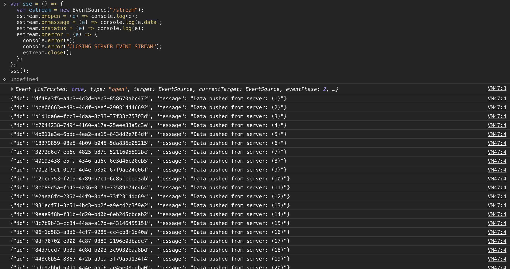

### Server-sent Events (SSE)

[Modzilla firefox documentation on SSE](https://developer.mozilla.org/en-US/docs/Web/API/Server-sent_events/Using_server-sent_events)

> Developing a web application that uses server-sent events is straightforward. You'll need a bit of code on the server to stream events to the front-end, but the client side code works almost identically to websockets in part of handling incoming events. This is one-way connection, so you can't send events from a client to a server.

##### Weird behavior of server-sent events
- The response returned must be in this format, with 2 newline characters at the end `\n\n`
- ```
  id: <optional>
  event: <optional>
  data: <payload>
  ```

### Installing dependencies
```
# python 3
$ virtualenv env
$ pip install -r requirements.txt
```

### Running the server
```
$ python app.py
# OR
$ export FLASK_ENV=development 
$ flask run
```

### Testing
Open `http://localhost:5000` and run these javascript commands in the console
```
var sse = () => {
  var estream = new EventSource("/stream");
  estream.onopen = (e) => console.log(e);
  estream.onmessage = (e) => console.log(e.data);
  estream.onstatus = (e) => console.log(e);
  estream.onerror = (e) => {
    console.error(e);
    console.error("CLOSING SERVER EVENT STREAM");
    estream.close();
  };
};
sse();
```


Based on the sever logs it was show that you the server sends multiple "responses" per request
```
127.0.0.1 - - [03/Sep/2020 22:57:52] "GET /stream HTTP/1.1" 200 -
[2020-09-03 22:57:52,936] DEBUG in app: {'id': 'bce00663-ed8d-44df-beef-290314446692', 'message': 'Data pushed from server: (2)'}
[2020-09-03 22:57:53,140] DEBUG in app: {'id': 'b1d1da6e-fcc3-4daa-8c33-37f33c75703d', 'message': 'Data pushed from server: (3)'}
[2020-09-03 22:57:53,290] DEBUG in app: {'id': 'c7044238-749f-4160-a17a-25eee33a5c3e', 'message': 'Data pushed from server: (4)'}
[2020-09-03 22:57:53,441] DEBUG in app: {'id': '4b811a3e-6bdc-4ea2-aa15-643dd2e784df', 'message': 'Data pushed from server: (5)'}
[2020-09-03 22:57:53,580] DEBUG in app: {'id': '18379859-08a5-4b09-b045-5da836e05215', 'message': 'Data pushed from server: (6)'}
[2020-09-03 22:57:53,593] DEBUG in app: {'id': '3272d6c7-eb6c-4825-b87e-5211605592bc', 'message': 'Data pushed from server: (7)'}
[2020-09-03 22:57:53,675] DEBUG in app: {'id': '40193438-e5fa-4346-ad6c-6e3d46c20eb5', 'message': 'Data pushed from server: (8)'}
[2020-09-03 22:57:53,771] DEBUG in app: {'id': '70e2f9c1-0179-4d4e-b350-67f9ae24e06f', 'message': 'Data pushed from server: (9)'}
[2020-09-03 22:57:53,894] DEBUG in app: {'id': 'c2bcd753-f219-4789-b7c1-6c851cbea3ab', 'message': 'Data pushed from server: (10)'}
```
